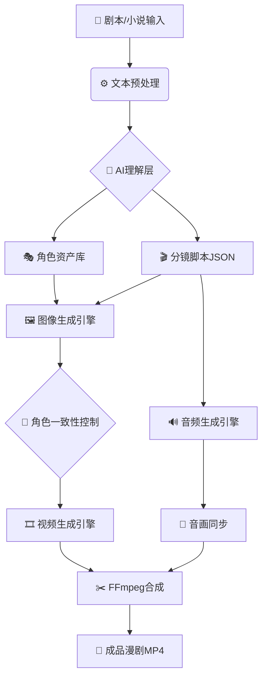

# 🎭 AI漫剧制作工作流 - 技术架构与实现指南

## 📋 系统概述

基于你提供的完整技术蓝图，我们实现了一个**工业级的AI漫剧生产流水线**，将人文创作的模糊灵感通过精密的工程设计转化为标准化的数据管线。

### 核心理念

> **"先搭骨架，再填血肉"** - 使用JSON作为模块间的通用语言，确保整个流程清晰可控。

---

## 🏗️ 系统架构

### 总体流程图



### 五步工作流设计

1. **导入剧本** - TXT/PDF/Word文件解析
2. **生成分镜** - LLM智能分析生成结构化JSON
3. **角色配置** - LoRA/IP-Adapter一致性控制
4. **批量生成** - 自动化图像/视频生产队列
5. **最终合成** - TTS配音+字幕+FFmpeg渲染

---

## 🔗 核心数据结构 - 分镜脚本JSON

这是整个系统的"通用语言"，所有模块都基于此格式交互：

```json
{
  "episode_id": 1,
  "title": "急诊室的故事",
  "scenes": [
    {
      "scene_id": "S001",
      "description": "在医院的走廊里，阳光透过窗户...",
      "characters": ["主角-李明", "配角-张医生"],
      "duration": 5,
      "shots": [
        {
          "shot_id": 1,
          "duration": 3,
          "camera": "medium_shot",
          "character": "主角-李明",
          "prompt": "A handsome Chinese doctor Li Ming, ~30 yo, stethoscope, looking exhausted in a hospital corridor, dramatic lighting, 8K, cinematic. --ar 16:9",
          "dialogue": "这已经是今天第几台手术了？我感到好累。"
        }
      ]
    }
  ]
}
```

### 字段说明

| 字段 | 类型 | 说明 |
|------|------|------|
| `episode_id` | number | 剧集编号 |
| `scenes` | array | 场景列表 |
| `scene_id` | string | 场景唯一标识（如S001） |
| `description` | string | 场景描述 |
| `characters` | array | 出场角色列表 |
| `duration` | number | 场景时长（秒） |
| `shots` | array | 镜头列表 |
| `shot_id` | number | 镜头序号 |
| `camera` | string | 景别（long_shot/medium_shot/close_up） |
| `prompt` | string | AI绘画提示词 |
| `dialogue` | string | 角色台词 |

---

## 🛠️ 模块实现详解

### 模块一：剧本理解与分镜生成

#### 功能职责
- 读取原始剧本（TXT/PDF/Word）
- 调用LLM进行场景分割和角色识别
- 生成结构化的分镜脚本JSON

#### 技术实现

**前端模拟实现**（当前版本）：
```javascript
// ComicDramaTool.jsx 中的模拟逻辑
const sampleStoryboard = {
  episode_id: 1,
  title: "急诊室的故事",
  scenes: [...] // 预定义的分镜数据
}

// 模拟AI分析过程
await new Promise(r => setTimeout(r, 2000))
setStoryboard(sampleStoryboard)
```

**后端真实实现**（待集成）：
```go
// Go + Gemini API 示例
func generateScript(ctx context.Context, client *genai.Client, rawScript string) (*Storyboard, error) {
    model := client.GenerativeModel("gemini-1.5-pro")
    
    prompt := fmt.Sprintf(`
你是一个专业的漫剧分镜师。请将以下小说片段转换成结构化的JSON分镜脚本。
小说片段: %s
输出格式要求: ...
`, rawScript)
    
    resp, err := model.GenerateContent(ctx, genai.Text(prompt))
    // 解析返回的JSON...
}
```

#### LLM提示词工程要点

```
你是一个专业的漫剧分镜师。请将以下小说片段转换成结构化的JSON分镜脚本。

要求：
1. 识别所有场景边界
2. 提取每个场景的角色列表
3. 为每个场景设计2-4个镜头
4. 为每个镜头生成高质量的英文绘画提示词
5. 标注镜头景别（远景/中景/近景/特写）
6. 提取角色对话内容

输出格式：严格的JSON结构
```

---

### 模块二：角色一致性控制

这是AI漫剧制作的**最大技术挑战**，直接影响观看体验。

#### 三种进阶方案对比

| 方案 | 原理 | 优点 | 缺点 | 适用场景 |
|------|------|------|------|---------|
| **高级提示词** | 固定详尽的角色描述 | 最简单，无需训练 | 不稳定，特征易丢失 | 快速原型 |
| **IP-Adapter** | 参考图捕捉角色ID | 效果惊艳，灵活 | 需技术集成 | 中等项目 |
| **LoRA微调** | 专属角色模型训练 | **最稳定**，可控性高 | 需数据集和训练时间 | 长篇漫剧 |

#### 最佳实践：**三保险方案**

```
LoRA（脸部稳定） + IP-Adapter（风格统一） + ControlNet（姿态控制）
```

#### 前端UI实现

```jsx
// 角色配置界面
<div className="character-card">
  <div className="character-avatar">
    
  </div>
  <div className="character-info">
    <h4>{char.name}</h4>
    <label className="upload-btn-small">
      <input type="file" accept="image/*" />
      上传参考图
    </label>
    <select className="lora-select">
      <option value="">选择LoRA模型</option>
      <option value="anime-style-v1">动漫风格 v1</option>
      <option value="realistic-portrait">写实人像</option>
    </select>
  </div>
</div>
```

#### 后端集成示例（Stable Diffusion + LoRA）

```python
# Python伪代码
def generate_with_lora(prompt, character_name, lora_model):
    # 加载LoRA权重
    pipe.load_lora_weights(f"models/{lora_model}.safetensors")
    
    # 生成图像
    image = pipe(
        prompt=prompt,
        negative_prompt="low quality, blurry",
        num_inference_steps=30,
        guidance_scale=7.5
    ).images[0]
    
    return image
```

---

### 模块三：批量图像与视频生成

#### 生成队列管理

```javascript
// 批量生成逻辑
const totalShots = storyboard.scenes.reduce((sum, s) => sum + s.shots.length, 0)
const completedShots = Object.keys(generatedAssets).length

// 单个镜头生成
onClick={async () => {
  await new Promise(r => setTimeout(r, 1500))
  setGeneratedAssets(prev => ({
    ...prev,
    [assetKey]: {
      imageUrl: `https://picsum.photos/seed/${assetKey}/512/288`,
      videoUrl: null
    }
  }))
}}

// 批量生成全部
for (const scene of storyboard.scenes) {
  for (const shot of scene.shots) {
    const assetKey = `${scene.scene_id}_${shot.shot_id}`
    if (!generatedAssets[assetKey]) {
      await generateShot(shot) // 调用API
    }
  }
}
```

#### 图像生成API集成

**推荐服务**：
- **SiliconFlow** - 国内访问速度快
- **Replicate** - 模型丰富
- **本地Stable Diffusion** - 完全可控

**API调用示例**：
```javascript
const response = await fetch(`${config.API_BASE_URL}/api/siliconflow/text-to-image`, {
  method: 'POST',
  headers: { 'Content-Type': 'application/json' },
  body: JSON.stringify({
    prompt: shot.prompt,
    width: 512,
    height: 288,
    steps: 30,
    guidance_scale: 7.5
  })
})
```

#### 视频生成API集成

**推荐服务**：
- **可灵AI（Kling）** - 中文支持好
- **Runway Gen-2** - 质量高
- **Pika Labs** - 速度快

---

### 模块四：音频生成与同步

#### TTS配音引擎选择

| 引擎 | 语言支持 | 音质 | 价格 | 特点 |
|------|---------|------|------|------|
| **Azure TTS** | 多语言 | ⭐⭐⭐⭐ | 中等 | 情感丰富 |
| **ElevenLabs** | 多语言 | ⭐⭐⭐⭐⭐ | 较高 | 最自然 |
| **Coqui TTS** | 开源 | ⭐⭐⭐ | 免费 | 本地部署 |

#### 前端音频配置UI

```jsx
<div className="audio-options">
  <div className="option-row">
    <label>配音引擎：</label>
    <select>
      <option>Azure TTS (中文)</option>
      <option>ElevenLabs (多语言)</option>
      <option>本地Coqui TTS</option>
    </select>
  </div>
  <div className="option-row">
    <label>背景音乐：</label>
    <select>
      <option>自动生成 (AI作曲)</option>
      <option>上传自定义BGM</option>
      <option>无背景音乐</option>
    </select>
  </div>
</div>
```

#### 字幕生成

**方法1：LLM生成SRT**
```javascript
// 调用ChatGPT/Gemini生成字幕
const subtitlePrompt = `
请为以下对话生成SRT格式字幕，时间轴根据语音时长自动分配：

${storyboard.scenes.map(s => 
  s.shots.map(sh => sh.dialogue).filter(Boolean).join('\n')
).join('\n')}
`
```

**方法2：Whisper语音识别**
```python
# 使用OpenAI Whisper从TTS音频生成字幕
import whisper

model = whisper.load_model("base")
result = model.transcribe("dialogue.wav")
# 导出为SRT格式
```

---

### 模块五：FFmpeg最终合成

#### 核心合成流程

```javascript
// 前端触发后端FFmpeg处理
const response = await fetch(`${config.API_BASE_URL}/api/comic-drama/synthesize`, {
  method: 'POST',
  headers: { 'Content-Type': 'application/json' },
  body: JSON.stringify({
    videoClips: generatedVideoUrls,
    audioTracks: ttsAudioUrls,
    bgm: bgmUrl,
    subtitles: srtContent,
    outputFormat: 'mp4'
  })
})
```

#### 后端FFmpeg命令构建（Go示例）

```go
func buildFFmpegCommand(scenes []Scene, audioFiles []string, subtitleFile string) *exec.Cmd {
    args := []string{}
    
    // 添加所有视频输入
    for _, scene := range scenes {
        args = append(args, "-i", scene.videoPath)
    }
    
    // 添加所有音频输入
    for _, audio := range audioFiles {
        args = append(args, "-i", audio)
    }
    
    // 构建复杂滤镜图
    filterComplex := buildComplexFilter(len(scenes), len(audioFiles))
    args = append(args, 
        "-filter_complex", filterComplex,
        "-map", "[outv]",
        "-map", "[outa]",
        "-vf", fmt.Sprintf("subtitles=%s", subtitleFile),
        "-c:v", "libx264",
        "-preset", "fast",
        "-crf", "22",
        "-c:a", "aac",
        "-b:a", "192k",
        "output.mp4",
    )
    
    return exec.Command("ffmpeg", args...)
}

func buildComplexFilter(videoCount, audioCount int) string {
    // 视频拼接
    videoConcat := ""
    for i := 0; i < videoCount; i++ {
        videoConcat += fmt.Sprintf("[%d:v]", i)
    }
    videoConcat += fmt.Sprintf("concat=n=%d:v=1:a=0[outv]", videoCount)
    
    // 音频混合
    audioMix := ""
    for i := 0; i < audioCount; i++ {
        audioMix += fmt.Sprintf("[%d:a]", i)
    }
    audioMix += fmt.Sprintf("amix=inputs=%d:duration=longest[outa]", audioCount)
    
    return fmt.Sprintf("%s;%s", videoConcat, audioMix)
}
```

---

## 📊 性能优化策略

### 1. 并行生成

```javascript
// 同时生成多个镜头
const generateBatch = async (shots) => {
  const promises = shots.map(shot => generateShot(shot))
  return Promise.all(promises)
}
```

### 2. 缓存机制

```javascript
// 缓存已生成的镜头
const cache = new Map()

const getCachedOrGenerate = async (shotId, shot) => {
  if (cache.has(shotId)) {
    return cache.get(shotId)
  }
  const result = await generateShot(shot)
  cache.set(shotId, result)
  return result
}
```

### 3. CDN加速

- 图像/视频资源上传到OSS/CDN
- 使用预签名URL提高加载速度

---

## 🎯 实施路线图

### 🌱 MVP阶段（1-2周）

**目标**：验证核心流程可行性

**任务清单**：
- ✅ 前端UI完成（已完成）
- ⏳ 手动编写分镜JSON
- ⏳ 使用Midjourney生成静态图
- ⏳ 用剪映手动合成视频

**预期产出**：第一个demo视频

---

### 🚀 自动化阶段（3-6周）

**目标**：实现半自动化生产

**任务清单**：
- ⏳ 集成LLM API自动生成分镜
- ⏳ 接入Stable Diffusion批量出图
- ⏳ 集成可灵API图生视频
- ⏳ 接入Azure TTS配音
- ⏳ FFmpeg后端服务

**预期产出**：端到端自动化流水线

---

### 🏆 工业化阶段（7-12周）

**目标**：建立规模化生产能力

**任务清单**：
- ⏳ LoRA模型训练平台
- ⏳ 角色资产管理数据库
- ⏳ 分布式任务队列（Celery/Bull）
- ⏳ GPU集群调度
- ⏳ 成本优化（按需启停GPU）

**预期产出**：日产能100+集漫剧

---

## 💡 最佳实践总结

### 1. 提示词工程

**优质提示词公式**：
```
[主体描述] + [环境背景] + [动作状态] + [光影效果] + [风格修饰] + [技术参数]

示例：
A handsome Chinese doctor Li Ming, ~30 yo, stethoscope, 
looking exhausted in a hospital corridor, 
dramatic lighting from window, 
cinematic composition, 
8K, highly detailed, professional photography. --ar 16:9
```

### 2. 角色一致性技巧

- **固定描述模板**：为每个角色创建标准描述卡片
- **参考图库**：收集20-30张不同角度照片训练LoRA
- **负面提示词**：明确排除不希望出现的特征

### 3. 成本控制

- **分层策略**：关键镜头用高质量模型，过渡镜头用快速模型
- **批量折扣**：集中采购API额度
- **本地部署**：高频使用的模型本地化

---

## 🔮 未来扩展方向

### 1. 交互式编辑

- 可视化分镜编辑器（拖拽调整镜头顺序）
- 实时预览修改效果
- A/B测试不同参数组合

### 2. 模板市场

- 用户分享成功的分镜模板
- 一键应用他人参数配置
- 评分和评论系统

### 3. 协作功能

- 多人协同创作（编剧/导演/美术分工）
- 版本控制和审阅流程
- 项目管理看板

### 4. AI辅助创作

- 自动生成剧情大纲
- 智能推荐镜头构图
- 自动配乐和音效

---

## 📚 参考资料

### 开源项目
- [waoowaoo](https://github.com/waoowaoo) - AI漫画生成工具
- [AIComicBuilder](https://github.com/AIComicBuilder) - 漫画制作框架
- [drama-workshop](https://github.com/drama-workshop) - 戏剧工作流平台

### 技术文档
- [Stable Diffusion官方文档](https://stability.ai/)
- [ComfyUI工作流指南](https://github.com/comfyanonymous/ComfyUI)
- [FFmpeg完整文档](https://ffmpeg.org/documentation.html)

### API服务
- [SiliconFlow](https://siliconflow.cn/) - 国内AI API聚合
- [Replicate](https://replicate.com/) - 开源模型托管
- [可灵AI](https://klingai.com/) - 视频生成API

---

## 🎉 结语

AI漫剧工作流的本质是**将创意工业化**。通过精密的数据管线设计，我们可以将人文创作的模糊灵感转化为标准化的生产流程。这不仅是个人创作的进阶之路，更可扩展为未来的**AI内容工厂**。

**记住核心理念**：
> 先用JSON搭建骨架，再用AI填充血肉，最后用FFmpeg完成缝合。

祝你在AI漫剧创作的道路上取得成功！如有任何技术问题，欢迎继续交流～ 🚀
